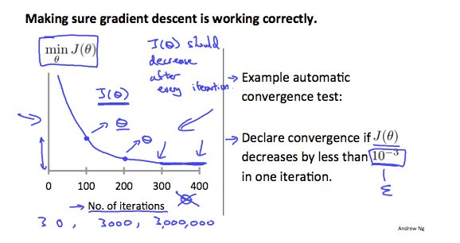
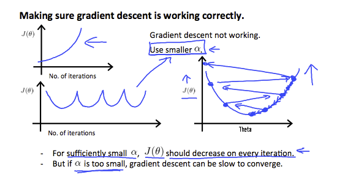
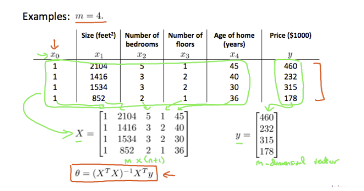

# Multivariate Linear Regression

Linear regression with multiple variables is also known as "multivariate linear regression".

We now introduce notation for equations where we can have any number of input variables.

 ${x^{(i)}}_j$ = value of feature *j* in the $i^{th}$ training example

 $x^{i}$= the input (features) of the  $i^{th}$ training example

$m$ = the number of training examples

$n$ = the number of features

 The multi-variable form of the hypothesis function accommodating these multiple features is as follows: 
$$
h_{\theta}(x)=\theta_{0}+\theta_{1} x_{1}+\theta_{2} x_{2}+\theta_{3} x_{3}+\cdots+\theta_{n} x_{n}
$$
In order to develop intuition about this function, we can think about $\theta_0$ as the basic price of a house, $\theta_1$ as the price per square meter, $\theta_2$ as the price per floor, etc. $x_1$ will be the number of square meters in the house, $x_2$ the number of floors, etc.

Using the definition of matrix multiplication, our multi-variable hypothesis function can be concisely represented as:
$$
h_{\theta}(x)=\left[\begin{array}{llll}{\theta_{0}} & {\theta_{1}} & {\ldots} & {\theta_{n}}\end{array}\right]\left[\begin{array}{c}{x_{0}} \\ {x_{1}} \\ {\vdots} \\ {x_{n}}\end{array}\right]=\theta^{T} x
$$
This is a vectorization of our hypothesis function for one training example; see the lessons on vectorization to learn more.

Remark: Note that for convenience reasons in this course we assume $x^{(i)}_0$=1 for (*i*∈1,…,*m*). This allows us to do matrix operations with theta and x. Hence making the two vectors $\theta$ and $x^{(i)}$ match each other element-wise (that is, have the same number of elements: n+1).

# Gradient Descent For Multiple Variables

 The gradient descent equation itself is generally the same form; we just have to repeat it for our 'n' features: 
$$
\begin{array}{l}{\text { repeat until convergence: }\{} \\ {\theta_{0}:=\theta_{0}-\alpha \frac{1}{m} \sum_{i=1}^{m}\left(h_{\theta}\left(x^{(i)}\right)-y^{(i)}\right) \cdot x_{0}^{(i)}} \\ {\theta_{1}:=\theta_{1}-\alpha \frac{1}{m} \sum_{i=1}^{m}\left(h_{\theta}\left(x^{(i)}\right)-y^{(i)}\right) \cdot x_{1}^{(i)}} \\ {\theta_{2}:=\theta_{2}-\alpha \frac{1}{m} \sum_{i=1}^{m}\left(h_{\theta}\left(x^{(i)}\right)-y^{(i)}\right) \cdot x_{2}^{(i)}} \\ {\cdots} \\ {\}}\end{array}
$$
 In other words: 
$$
\begin{array}{l}{\text { repeat until convergence: }\{} \\ {\theta_{j}:=\theta_{j}-\alpha \frac{1}{m} \sum_{i=1}^{m}\left(h_{\theta}\left(x^{(i)}\right)-y^{(i)}\right) \cdot x_{j}^{(i)} \quad \text { for } j:=0 \ldots n}\end{array}
$$
 The following image compares gradient descent with one variable to gradient descent with multiple variables: 

# Gradient Descent in Practice I - Feature Scaling

We can speed up gradient descent by having each of our input values in roughly the same range. This is because θ will descend quickly on small ranges and slowly on large ranges, and so will oscillate inefficiently down to the optimum when the variables are very uneven.

The way to prevent this is to modify the ranges of our input variables so that they are all roughly the same. Ideally:

−1 ≤ $x_{(i)}$ ≤ 1

or

−0.5 ≤ $x_{(i)}$ ≤ 0.5

These aren't exact requirements; we are only trying to speed things up. The goal is to get all input variables into roughly one of these ranges, give or take a few.

Two techniques to help with this are **`feature scaling`** and **`mean normalization`**. Feature scaling involves dividing the input values by the range (i.e. the maximum value minus the minimum value) of the input variable, resulting in a new range of just 1. Mean normalization involves subtracting the average value for an input variable from the values for that input variable resulting in a new average value for the input variable of just zero. To implement both of these techniques, adjust your input values as shown in this formula:

$$
x_i := \dfrac{x_i - \mu_i}{s_i}
$$
Where **$μ_i$** is the **average** of all the values for feature (i) and $s_i$ is the range of values (max - min), or $s_i$ is the standard deviation.

Note that dividing by the range, or dividing by the standard deviation, give different results. The quizzes in this course use range - the programming exercises use standard deviation.

For example, if $x_i$ represents housing prices with a range of 100 to 2000 and a mean value of 1000, then, 
$$
x_i := \dfrac{price-1000}{1900}
$$

## Gradient Descent in Practice II - Learning Rate

**`Debugging gradient descent`.** Make a plot with *number of iterations* on the x-axis. Now plot the cost function, J(θ) over the number of iterations of gradient descent. If J(θ) ever increases, then you probably need to decrease α.

**`Automatic convergence test.`** Declare convergence if J(θ) decreases by less than E in one iteration, where E is some small value such as $10^{−3}$. However in practice it's difficult to choose this threshold value.

It has been proven that if learning rate α is sufficiently small, then J(θ) will decrease on every iteration.

To summarize:

If α is too small: slow convergence.

If α is too large: may not decrease on every iteration and thus may not converge.

## Features and Polynomial Regression

We can improve our features and the form of our hypothesis function in a couple different ways.

We can **combine** multiple features into one. For example, we can combine $x_1$ and $x_2$ into a new feature $x_3$ by taking $x_1$⋅$x_2$.

### **Polynomial Regression**

Our hypothesis function need not be linear (a straight line) if that does not fit the data well.

We can **change the behavior or curve** of our hypothesis function by making it a quadratic, cubic or square root function (or any other form).

For example, if our hypothesis function is $h_\theta(x) = \theta_0 + \theta_1 x_1$ then we can create additional features based on $x_1$, to get the quadratic function $h_\theta(x) = \theta_0 + \theta_1 x_1 + \theta_2 x_1^2$ or the cubic function $h_\theta(x) = \theta_0 + \theta_1 x_1 + \theta_2 x_1^2 + \theta_3 x_1^3$

In the cubic version, we have created new features $x_2$and $x_3$where $x_2 = x_1^2$ and $x_3 = x_1^3$.

To make it a square root function, we could do: $h_\theta(x) = \theta_0 + \theta_1 x_1 + \theta_2 \sqrt{x_1}$

One important thing to keep in mind is, **`if you choose your features this way then feature scaling becomes very important.`**

eg. if $x_1$ has range 1 - 1000 then range of $x_1^2 $ becomes 1 - 1000000 and that of $x_1^3$ becomes 1 - 1000000000

## Normal Equation

Gradient descent gives one way of minimizing J. Let's discuss a second way of doing so, this time performing the minimization explicitly and without resorting to an iterative algorithm. In the "Normal Equation" method, we will minimize J by explicitly taking its derivatives with respect to the θj ’s, and setting them to zero. This allows us to find the optimum theta without iteration. The normal equation formula is given below:
$$
θ=(X^TX)^{−1}X^Ty
$$

There is **no need** to do feature scaling with the normal equation.

The following is a comparison of gradient descent and the normal equation:

|      Gradient Descent      |                 Normal Equation                 |
| :------------------------: | :---------------------------------------------: |
|    Need to choose alpha    |             No need to choose alpha             |
|   Needs many iterations    |               No need to iterate                |
|         O ($kn^2$)         | O ($n^3$), need to calculate inverse of $X^TX$. |
| Works well when n is large |             Slow if n is very large             |

With the normal equation, computing the inversion has complexity O(*n*3). So if we have a very large number of features, the normal equation will be slow. In practice, when n exceeds 10,000 it might be a good time to go from a normal solution to an iterative process.

## Normal Equation Noninvertibility

When implementing the normal equation in octave we want to use the 'pinv' function rather than 'inv.' The 'pinv' function will give you a value of $\theta$ even if $X^TX$ is not invertible.

If $X^TX$ is **noninvertible,** the common causes might be having :

- Redundant features, where two features are very closely related (i.e. they are linearly dependent)
- Too many features (e.g. m ≤ n). In this case, delete some features or use "regularization" (to be explained in a later lesson).

Solutions to the above problems include deleting a feature that is linearly dependent with another or deleting one or more features when there are too many features.