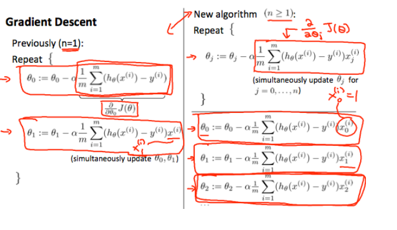

# Multivariate Linear Regression

Linear regression with multiple variables is also known as "multivariate linear regression".

We now introduce notation for equations where we can have any number of input variables.

 ${x^{(i)}}_j$ = value of feature *j* in the $i^{th}$ training example

 $x^{i}$= the input (features) of the  $i^{th}$ training example

$m$ = the number of training examples

$n$ = the number of features

 The multi-variable form of the hypothesis function accommodating these multiple features is as follows: 
$$
h_{\theta}(x)=\theta_{0}+\theta_{1} x_{1}+\theta_{2} x_{2}+\theta_{3} x_{3}+\cdots+\theta_{n} x_{n}
$$
In order to develop intuition about this function, we can think about $\theta_0$ as the basic price of a house, $\theta_1$ as the price per square meter, $\theta_2$ as the price per floor, etc. $x_1$ will be the number of square meters in the house, $x_2$ the number of floors, etc.

Using the definition of matrix multiplication, our multi-variable hypothesis function can be concisely represented as:
$$
h_{\theta}(x)=\left[\begin{array}{llll}{\theta_{0}} & {\theta_{1}} & {\ldots} & {\theta_{n}}\end{array}\right]\left[\begin{array}{c}{x_{0}} \\ {x_{1}} \\ {\vdots} \\ {x_{n}}\end{array}\right]=\theta^{T} x
$$
This is a vectorization of our hypothesis function for one training example; see the lessons on vectorization to learn more.

Remark: Note that for convenience reasons in this course we assume $x^{(i)}_0$=1 for (*i*∈1,…,*m*). This allows us to do matrix operations with theta and x. Hence making the two vectors $\theta$ and $x^{(i)}$ match each other element-wise (that is, have the same number of elements: n+1).

# Gradient Descent For Multiple Variables

 The gradient descent equation itself is generally the same form; we just have to repeat it for our 'n' features: 
$$
\begin{array}{l}{\text { repeat until convergence: }\{} \\ {\theta_{0}:=\theta_{0}-\alpha \frac{1}{m} \sum_{i=1}^{m}\left(h_{\theta}\left(x^{(i)}\right)-y^{(i)}\right) \cdot x_{0}^{(i)}} \\ {\theta_{1}:=\theta_{1}-\alpha \frac{1}{m} \sum_{i=1}^{m}\left(h_{\theta}\left(x^{(i)}\right)-y^{(i)}\right) \cdot x_{1}^{(i)}} \\ {\theta_{2}:=\theta_{2}-\alpha \frac{1}{m} \sum_{i=1}^{m}\left(h_{\theta}\left(x^{(i)}\right)-y^{(i)}\right) \cdot x_{2}^{(i)}} \\ {\cdots} \\ {\}}\end{array}
$$
 In other words: 
$$
\begin{array}{l}{\text { repeat until convergence: }\{} \\ {\theta_{j}:=\theta_{j}-\alpha \frac{1}{m} \sum_{i=1}^{m}\left(h_{\theta}\left(x^{(i)}\right)-y^{(i)}\right) \cdot x_{j}^{(i)} \quad \text { for } j:=0 \ldots n}\end{array}
$$
 The following image compares gradient descent with one variable to gradient descent with multiple variables: 

# Gradient Descent in Practice I - Feature Scaling

We can speed up gradient descent by having each of our input values in roughly the same range. This is because θ will descend quickly on small ranges and slowly on large ranges, and so will oscillate inefficiently down to the optimum when the variables are very uneven.

The way to prevent this is to modify the ranges of our input variables so that they are all roughly the same. Ideally:

−1 ≤ $x_{(i)}$ ≤ 1

or

−0.5 ≤ $x_{(i)}$ ≤ 0.5

These aren't exact requirements; we are only trying to speed things up. The goal is to get all input variables into roughly one of these ranges, give or take a few.

Two techniques to help with this are **feature scaling** and **mean normalization**. Feature scaling involves dividing the input values by the range (i.e. the maximum value minus the minimum value) of the input variable, resulting in a new range of just 1. Mean normalization involves subtracting the average value for an input variable from the values for that input variable resulting in a new average value for the input variable of just zero. To implement both of these techniques, adjust your input values as shown in this formula:

x_i := \dfrac{x_i - \mu_i}{s_i}*x**i*:=*s**i**x**i*−*μ**i*

Where *μ**i* is the **average** of all the values for feature (i) and s_i*s**i* is the range of values (max - min), or s_i*s**i* is the standard deviation.

Note that dividing by the range, or dividing by the standard deviation, give different results. The quizzes in this course use range - the programming exercises use standard deviation.

For example, if x_i*x**i* represents housing prices with a range of 100 to 2000 and a mean value of 1000, then, x_i := \dfrac{price-1000}{1900}*x**i*:=1900*p**r**i**c**e*−1000.